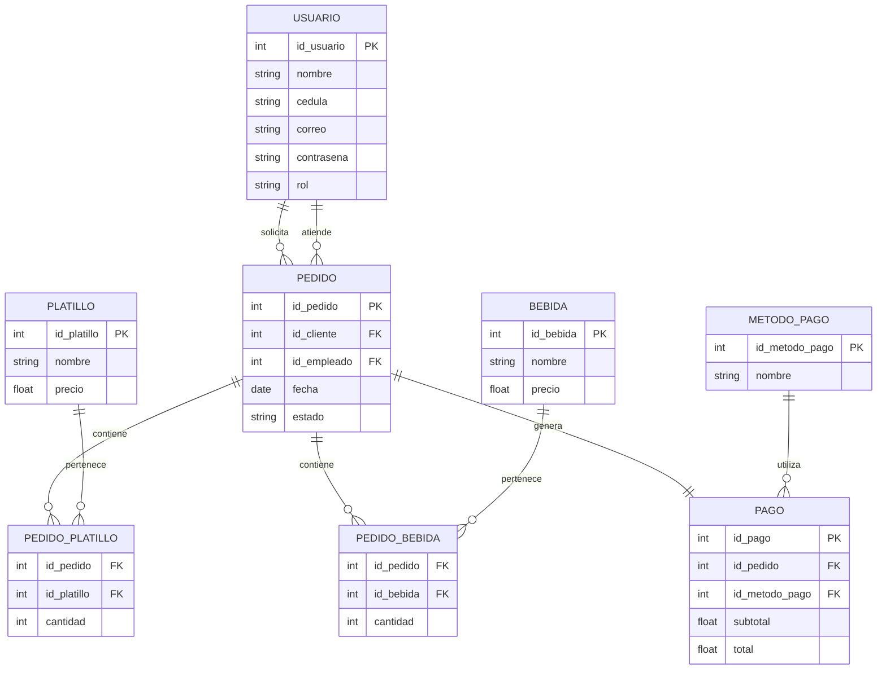

# Modelo Entidad Relación

```mermaid
erDiagram

    USUARIO ||--o{ PEDIDO : solicita
    USUARIO ||--o{ PEDIDO : atiende

    PEDIDO ||--o{ PEDIDO_PLATILLO : contiene
    PLATILLO ||--o{ PEDIDO_PLATILLO : pertenece

    PEDIDO ||--o{ PEDIDO_BEBIDA : contiene
    BEBIDA ||--o{ PEDIDO_BEBIDA : pertenece

    PEDIDO ||--|| PAGO : genera
    METODO_PAGO ||--o{ PAGO : utiliza

    USUARIO {
        int id_usuario PK
        string nombre
        string cedula
        string correo
        string contrasena
        string rol
    }

    PEDIDO {
        int id_pedido PK
        int id_cliente FK
        int id_empleado FK
        date fecha
        string estado
    }

    PLATILLO {
        int id_platillo PK
        string nombre
        float precio
    }

    BEBIDA {
        int id_bebida PK
        string nombre
        float precio
    }

    PEDIDO_PLATILLO {
        int id_pedido FK
        int id_platillo FK
        int cantidad
    }

    PEDIDO_BEBIDA {
        int id_pedido FK
        int id_bebida FK
        int cantidad
    }

    METODO_PAGO {
        int id_metodo_pago PK
        string nombre
    }

    PAGO {
        int id_pago PK
        int id_pedido FK
        int id_metodo_pago FK
        float subtotal
        float total
    }
```
