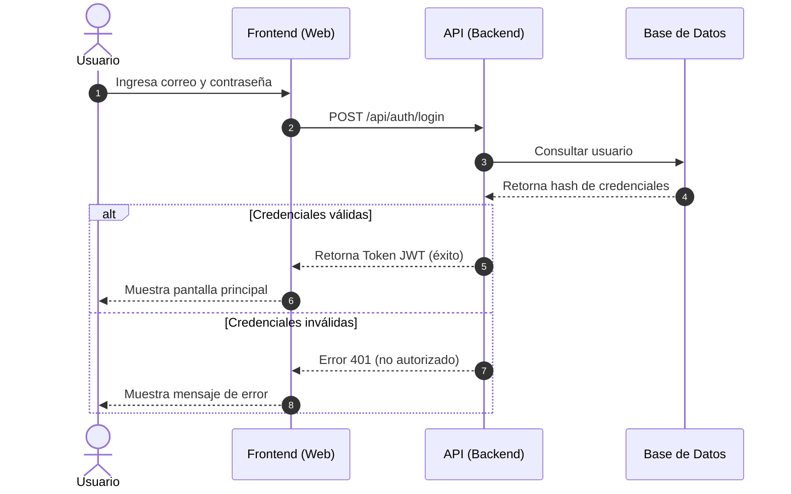
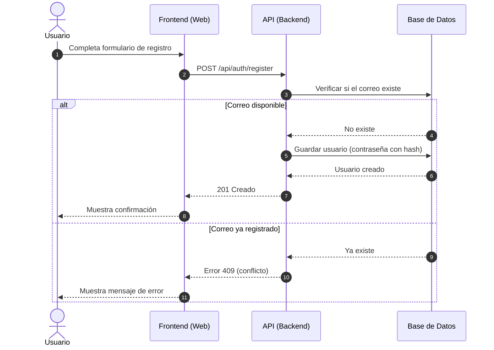

# Diagramas de Secuencia

## 1. Inicio de sesión

```mermaid
sequenceDiagram
    autonumber
    actor Usuario
    participant App as Frontend (Web)
    participant API as API (Backend)
    participant DB as Base de Datos

    Usuario->>App: Ingresa correo y contraseña
    App->>API: POST /api/auth/login
    API->>DB: Consultar usuario
    DB-->>API: Retorna hash de credenciales

    alt Credenciales válidas
        API-->>App: Retorna Token JWT (éxito)
        App-->>Usuario: Muestra pantalla principal
    else Credenciales inválidas
        API-->>App: Error 401 (no autorizado)
        App-->>Usuario: Muestra mensaje de error
    end
```

## 2. Registro de usuario

```mermaid
sequenceDiagram
    autonumber
    actor Usuario
    participant App as Frontend (Web)
    participant API as API (Backend)
    participant DB as Base de Datos

    Usuario->>App: Completa formulario de registro
    App->>API: POST /api/auth/register
    API->>DB: Verificar si el correo existe

    alt Correo disponible
        DB-->>API: No existe
        API->>DB: Guardar usuario (contraseña con hash)
        DB-->>API: Usuario creado
        API-->>App: 201 Creado
        App-->>Usuario: Muestra confirmación
    else Correo ya registrado
        DB-->>API: Ya existe
        API-->>App: Error 409 (conflicto)
        App-->>Usuario: Muestra mensaje de error
    end
```

> **Nota:** si el proyecto tiene otra funcionalidad clave, agregar su diagrama de secuencia aquí con el mismo formato.
