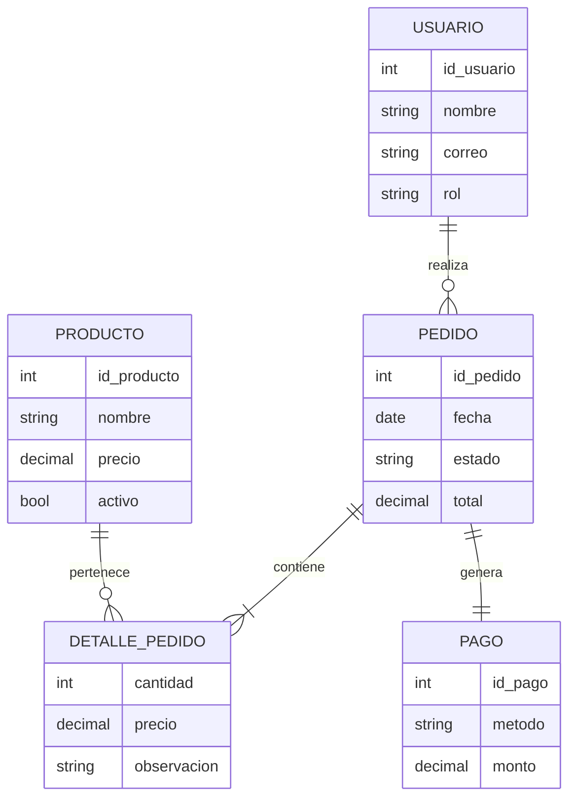

# Modelo Entidad Relación

```mermaid
erDiagram

USUARIO ||--o{ PEDIDO : realiza
PEDIDO ||--|{ DETALLE_PEDIDO : contiene
PRODUCTO ||--o{ DETALLE_PEDIDO : pertenece
PEDIDO ||--|| PAGO : genera

USUARIO {
 int id_usuario
 string nombre
 string correo
 string rol
}

PEDIDO {
 int id_pedido
 date fecha
 string estado
 decimal total
}

DETALLE_PEDIDO {
 int cantidad
 decimal precio
 string observacion
}

PRODUCTO {
 int id_producto
 string nombre
 decimal precio
 bool activo
}

PAGO {
 int id_pago
 string metodo
 decimal monto
}
```